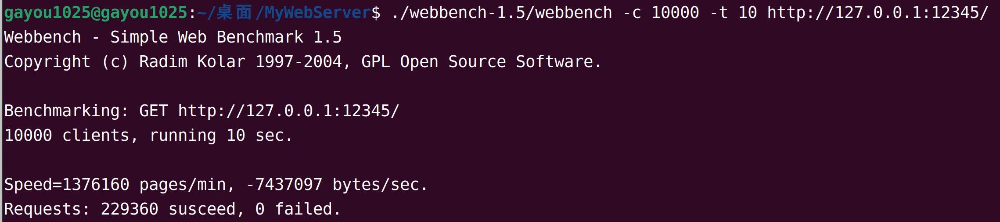

# WebServer

用C++实现的高性能Web服务器，经过webbenchh压力测试可以实现上万的QPS

## 功能

* 利用IO复用技术Epoll与线程池，实现多线程的Reactor高并发模型；
* 利用正则表达式与有限状态机 解析HTTP请求报文，实现对静态资源请求的处理与响应；
* 利用标准库容器vector封装char，实现自动增长的缓冲区；
* 基于最小堆实现的定时器，自动关闭超时的非活动连接；
* 利用单例模式与阻塞队列，实现异步的日志系统，记录服务器的运行状态；
* 利用RAII机制，实现数据库连接池，减少数据库连接建立与关闭的开销，同时实现用户的注册与登录功能。

## 环境要求

* Linux
* C++11
* MySQL

## 目录树

```
.
├── code           源代码
│   ├── buffer
│   ├── http
│   ├── log
│   ├── timer
│   ├── pool
│   ├── server
│   └── main.cpp
├── resources      静态资源
│   ├── index.html
│   ├── image
│   ├── video
│   ├── js
│   └── css
├── bin            可执行文件
│   └── server
├── log            日志文件
├── webbench-1.5   压力测试
├── build          
│   └── Makefile
├── Makefile
└── README.md
```


## 项目启动

需要先配置好对应的数据库，用于存储用户账户密码

```bash
# 建立yourdb库
create database yourdb;

# 创建user表
USE yourdb;
CREATE TABLE user(
    username char(50) NULL,
    password char(50) NULL
)ENGINE=InnoDB;

# 导入已有的用户账号密码数据
INSERT INTO user(username, password) VALUES('name', 'password');
```

```bash
make
./bin/server
```

## 单元测试

```bash
cd test
make
./test
```

## 压力测试



```bash
./webbench-1.5/webbench -c 100 -t 10 http://ip:port/
./webbench-1.5/webbench -c 1000 -t 10 http://ip:port/
./webbench-1.5/webbench -c 5000 -t 10 http://ip:port/
./webbench-1.5/webbench -c 10000 -t 10 http://ip:port/

./webbench-1.5/webbench -c 100 -t 10 http://127.0.0.1:12345/
```

* 测试环境： `Ubuntu：22.04` `cpu：i5-1240p` `内存：16G` `MySQL：5.7`
* QPS：10000+

## 配置

**main.cpp**

```cpp
WebServer server(
        12345, 3, 60000, false,                  // 监听端口，ET模式，timeoutMs，优雅退出
        3306, "username", "password", "yourdb",  // Mysql：端口，用户名，密码，数据库名
        12, 6, true, 1, 1024                     // 连接池大小，线程池大小，日志开关、等级、异步队列容量
    );
```

**ET模式：**

连接/监听模式

> 0：LT/LT
>
> 1：LT/ET
>
> 2：ET/LT
>
> 3：ET/ET

**日志等级：**

（数字越小，记录的日志信息越详细）

> ->0	[debug]			测试信息
>
> ​	->1	[info]			一般信息	
>
> ​		->2	[warn]		警告信息
>
> ​			->3	[error]	错误信息

## 致谢

Linux高性能服务器编程，游双著.

[@qinguoyi](https://github.com/qinguoyi/TinyWebServer)

[@markparticle](https://github.com/markparticle/WebServer)